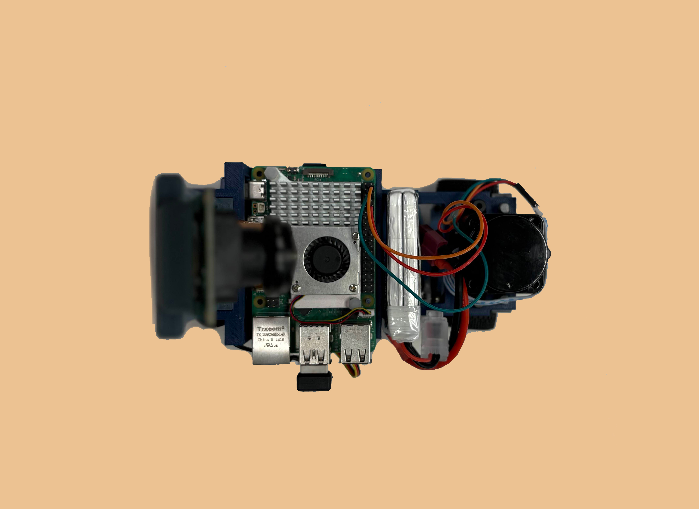

## Content

* `t-photos` contains 2 photos of the team as well as a personal photo of each member.
* `v-photos` contains 6 photos of the vehicle (from every side, from top and bottom)
* `video` contains the video.md file with the link to a video where driving demonstration exists
* `schemes` contains one or several schematic diagrams in form of JPEG, PNG or PDF of the electromechanical components illustrating all the elements (electronic components and motors) used in the vehicle and how they connect to each other.
* `src` contains code of control software for all components which were programmed to participate in the competition
* `models` is for the files for models used by 3D printers, laser cutting machines and CNC machines to produce the vehicle elements. If there is nothing to add to this location, the directory can be removed.
* `other` is for other files which can be used to understand how to prepare the vehicle for the competition. It may include documentation how to connect to a SBC/SBM and upload files there, datasets, hardware specifications, communication protocols descriptions etc. If there is nothing to add to this location, the directory can be removed.

Table of Contents
=====

- [The Team](#the-team)
  
  - [Team Photos](#team-photos)
  - [Jayden](#jayden)
  - [Arham](#arham)
  - [Trevor](#trevor)

- [JAT | WRO Documentation](#jat-wro-documentation)
  
  - [Task](#task)
  - [Challenge Descriptions](#challenge-descriptions)
    - [1. Open Challenge](#1-open-challenge)
    - [2. Obstacle Challenge](#2-obstacle-challenge)

- [Our Robot](#our-robot)
  
  - [Video Demonstrations](#video-demonstrations)

- [Engineering Design & Strategy](#engineering-design--strategy)
  
  - [Mobility Management](#mobility-management)
    - [Motor Selection and Implementation](#motor-selection-and-implementation)
    - [Wheels and Drivetrain Rationale](#wheels-and-drivetrain-rationale)
  - [Power and Sense Management](#power-and-sense-management)
    - [Power Source and Distribution](#power-source-and-distribution)
    - [Sensor Selection and Rationale](#sensor-selection-and-rationale)
  - [Structural Materials](#structural-materials)
    - [Custom 3D Printed Chassis (PLA)](#custom-3d-printed-chassis-pla)
    - [Custom 3D Printed Camera Holder (PLA)](#custom-3d-printed-camera-holder-pla)
  - [Mechanical Components](#mechanical-components)
    - [K989 Drivetrain Components](#k989-drivetrain-components)
    - [Custom Front Wheels](#custom-front-wheels)
    - [Fasteners and Hardware](#fasteners-and-hardware)

- [Cost Report](#cost-report)

- [Measurements](#measurements)

- [Assembly Guide](#assembly-guide)
  
  - [Overview](#overview)
  - [Required Tools](#required-tools)
  - [Required Components](#required-components)
  - [Assembly Steps](#assembly-steps)
    - [Step 1: Chassis Foundation Assembly](#step-1-chassis-foundation-assembly)
    - [Step 2: Platform and Electronics Mounting](#step-2-platform-and-electronics-mounting)
    - [Step 3: Sensor Integration](#step-3-sensor-integration)
    - [Step 4: Drive System Integration](#step-4-drive-system-integration)
    - [Step 5: Custom Steering System Assembly](#step-5-custom-steering-system-assembly)
    - [Step 6: Wheel and Tire Installation](#step-6-wheel-and-tire-installation)
    - [Step 7: System Wiring and Connections](#step-7-system-wiring-and-connections)
    - [Step 8: Final Assembly and Testing](#step-8-final-assembly-and-testing)

# The Team

## Team Photos

<table>
  <tr>
    <th>Normal Photo</th>
    <th>Silly Photo</th>
  </tr>
  <tr>
    <td align="center">
      
    </td>
    <td align="center">
      
    </td>
  </tr>
</table>

---

### Jayden

<p align="center">
  
</p>

> **WAAWAAW**

---

### Arham

<p align="center">
  
</p>

> **Syed Arham Wasti** is a Junior at Anderson CVI with a strong interest in computer science and machine learning. His ambition drives him to address issues he deeply cares about.

---

### Trevor

<p align="center">
  
</p>

> **WA WA WA**

# JAT | WRO \- Documentation |

## Task

The WRO 2025 Future Engineers Self-Driving Cars Challenge tasks teams with designing an autonomous vehicle to complete dynamic racetrack laps and perform parallel parking, adapting to randomized layouts and traffic signs. Teams must also document their engineering process in a public GitHub repository, showcasing innovation, adaptability, and technical problem-solving.

### Challenge Descriptions:

#### 1\. Open Challenge

Objective: The vehicle must autonomously complete three laps on a racetrack whose layout randomizes each round.

**Key Elements:**

- **Randomized Layouts:** The track may feature randomized corridor widths (narrow or wide sections) and varying starting positions.
  Dynamic configurations:  The track configuration (e.g., wall placements, starting zones) is determined by a randomization process (e.g., coin tosses, dice rolls) before each round.

- **Adaptability requirement:** The navigation algorithms of the vehicle are critical, having to adapt in real time to an unseen wall and course arrangement without human intervention.

**Performance Goal:**
Maximize the consistency and speed of laps under unknown track conditions.

#### 2\. Obstacle Challenge

Objective: The vehicle must complete three laps on a track with randomly placed traffic signs and then perform a parallel parking maneuver in a designated area.

**Key Elements:**

- **Traffic Signs:** Red and green pillars indicate required driving lanes (red = keep right, green = keep left). The vehicle must obey these rules without displacing the signs.
- **Parking Task:** After completing laps, the vehicle must park within a narrow, variable-sized parking space. Starting inside the parking lot and achieving parallel alignment earns bonus points.

**Randomization factors:**

- Traffic sign positions
- Parking lot placement
- Driving direction (clockwise/counterclockwise)

**Performance Goal:**
Complete the 3 laps without faults and complete a precise parallel parking maneuver whilst adapting to randomized factors.

# 

Our Robot
=====

|  |    |
|:------------------------------------------------:|:-------------------------------------------------:|
| *Front*                                          | *Back*                                            |
|   |   |
| *Left*                                           | *Right*                                           |
|    |  |
| *Top*                                            | *Bottom*                                          |

<p align="center">
 
   </p>
<br>

<br>

## Video Demonstrations

<table>
  <tr>
    <th>Open Challenge</th>
    <th>Obstacle Challenge</th>
  </tr>
  <tr>
    <td align="center">
      <a href="https://www.youtube.com/watch?v=GPGMuM1HHgo" target="_blank">
        
      </a>
    </td>
    <td align="center">
      <a href="https://www.youtube.com/watch?v=hhrCKOZkAMQ" target="_blank">
        
      </a>
    </td>
  </tr>
</table>

<div align="center"><small><em>Click the image for the video demonstration!</em></small></div>

# Engineering Design & Strategy

This section outlines the core engineering principles and strategic decisions that guided the development of our autonomous vehicle. We have broken down our design process into the key categories evaluated in the competition: Mobility, Power & Sensing, and Obstacle Management.

## Mobility Management

Effective mobility is central to navigating the course quickly and accurately. Our design focuses on a responsive drivetrain with precise steering control.

### Motor Selection and Implementation

<table width="800px"> <tr> <td width="400px" style="text-align: left; vertical-align: top;">  </td> <td width="400px" style="text-align: left; vertical-align: top;"> <h3>Furitek Micro Komodo Motor</h3> <ul> <li><b>KV:</b> 3450 RPM/Volt</li> <li><b>Power:</b> 120W</li> <li><b>Battery:</b> 2–3S LiPo</li> <li><b>Type:</b> Brushless</li> <li><b>Weight:</b> 17.5 g</li> </ul> </td> </tr> </table>

The Furitek Micro Komodo was selected for its exceptional power-to-weight ratio and precise speed control. As a brushless motor, it offers higher efficiency, a longer lifespan, and superior performance compared to brushed alternatives. Its ability to operate smoothly at both high and very low speeds is a significant advantage, providing the raw acceleration needed for fast laps and the delicate, slow-speed control required for the parallel parking maneuver.

<table width="800px"> <tr> <td width="400px" style="text-align: left; vertical-align: top;">  </td> <td width="400px" style="text-align: left; vertical-align: top; padding: 0;"> <h3>HS-5055MG Servo</h3> <ul> <li><b>Torque (6.0V):</b> 1.4 kg/cm</li> <li><b>Speed (6.0V):</b> 0.14 sec/60°</li> <li><b>Gears:</b> Metal</li> <li><b>Type:</b> Digital</li> <li><b>Weight:</b> 9.5 g</li> </ul> </td> </tr> </table>

Accurate path following is managed by a PID controller, which requires a steering servo capable of making small, precise, and rapid adjustments. The HS-5055MG was chosen for its digital precision and metal gear construction, providing the durability and responsiveness needed to translate the PID controller's outputs into exact steering angles. This ensures the vehicle can hold its line with minimal error.

### Wheels and Drivetrain Rationale

We use GT24 Carisma Wheels and Tires for their traction characteristics, ensuring consistent grip and power delivery. Other 1/24 scale RC car wheels and tires can be substituted.

## Power and Sense Management

A reliable power system and an accurate sensor suite are the foundation of any autonomous system. Our strategy was to choose components that provide clean power and rich, low-latency data to our control system.

### Power Source and Distribution

<table width="800px"> <tr> <td width="400px" style="text-align: left; vertical-align: top;">  </td> <td width="400px" style="text-align: left; vertical-align: top;"> <h3>Gens Ace 2S LiPo Battery</h3> <ul> <li><b>Capacity:</b> 1300mAh</li> <li><b>Voltage:</b> 7.4V (2S)</li> <li><b>Discharge Rate:</b> 45C</li> <li><b>Weight:</b> 90 g</li> </ul> </td> </tr> </table>

The Gens Ace 1300mAh LiPo was selected for its optimal balance of capacity, weight, and size. On a full charge, this battery provides approximately 45 minutes of continuous runtime, which is more than sufficient to complete all competition rounds and practice runs without needing a battery swap or experiencing performance degradation.

<table width="800px"> <tr> <td width="400px" style="text-align: left; vertical-align: top;"> <h3>Hiwonder Raspberry Pi 5 Expansion Board</h3> <ul> <li>Centralized Power Distribution</li> <li>Organized PWM Outputs</li> <li>Regulated Voltage for Sensors</li> <li>Direct Pi 5 Connectivity</li> </ul> </td> <td width="400px" style="text-align: left; vertical-align: top;">  </td> </tr> </table>

To eliminate the reliability issues of breadboards and loose wiring, we integrated the Hiwonder Expansion Board. It serves as a centralized hub for power management and signal distribution, providing stable, regulated power to the Pi, sensors, and servos. This simplifies the wiring harness, reduces potential failure points, and ensures consistent performance from all electronic components.

### Wiring Diagram


### Sensor Selection and Rationale

<table width="800px"> <tr> <td width="400px" style="text-align: left; vertical-align: top;">  </td> <td width="400px" style="text-align: left; vertical-align: top;"> <h3>Raspberry Pi 5</h3> <ul> <li><b>CPU:</b> Quad-core 64-bit Arm Cortex-A76 @ 2.4GHz</li> <li><b>RAM:</b> 8GB LPDDR4X</li> <li><b>Connectivity:</b> Wi-Fi, Bluetooth 5.0, Gigabit Ethernet</li> <li><b>I/O:</b> 40-pin GPIO, 2x MIPI DSI/CSI</li> </ul> </td> </tr> </table>
The Raspberry Pi 5 serves as the central processing unit, chosen for its powerful quad-core processor that can simultaneously handle real-time data streams from the camera and LiDAR without performance bottlenecks. The mature Python ecosystem and extensive GPIO interface were ideal for rapid algorithm development and direct control over all hardware.

<table width="800px"> <tr> <td width="400px" style="text-align: left; vertical-align: top;">  </td> <td width="400px" style="text-align: left; vertical-align: top;"> <h3>Pi Camera Module</h3> <ul> <li><b>Resolution:</b> 5 Megapixels</li> <li><b>Video:</b> 1080p HD</li> <li><b>Interface:</b> Direct CSI</li> <li><b>Features:</b> Color Sensing</li> </ul> </td> </tr> </table>
The Pi Camera is our primary sensor for the Obstacle Challenge. Its direct CSI interface provides a low-latency video feed essential for high-speed decision-making. We rely entirely on its color-sensing capabilities and OpenCV-based contour detection to accurately identify the pillars and boundary walls. The 175° wide angle lens, combined with a high mounting position on the chassis allows the camera to have an extremely large field of view throughout the challenge.


The camera mounted to a custom built holder. The holder is fixed to the back of the chassis. This allows for the maximum reaction window for obstacles. 

<table width="800px"> <tr> <td width="400px" style="text-align: left; vertical-align: top;"> <h3>LD19 D500 LIDAR</h3> <ul> <li><b>Range:</b> 0.02 - 12m</li> <li><b>Scan Rate:</b> 5-15 Hz</li> <li><b>Angular Resolution:</b> 0.5°</li> <li><b>Interface:</b> UART</li> </ul> </td> <td width="400px" style="text-align: left; vertical-align: top;">  </td> </tr> </table>
For navigation tasks where precision distance measurement is needed, we use the LD19 LIDAR. It is the sole sensor for the parallel parking maneuver. Once the parking sequence is initiated, color data is no longer needed, and the LIDAR's high-accuracy spatial data allows us to precisely detect the parking space and execute the multiple turns required to park.

## Structural Materials

### Custom 3D Printed Chassis

The main chassis and structural components are 3D printed in PLA plastic. PLA was selected for its excellent dimensional stability, ease of printing complex geometries, and sufficient strength for the application. The material allows for rapid prototyping iterations during development while providing the precision needed for proper component mounting and alignment.

 


### FURITEK LIZARD Pro ESC

The ESC provides the interface between our control system and the drive motor, selected for its low weight and small size. 

## Mechanical Components

### K989 Drivetrain Components

The design adapted select components from the K989 platform including the rear gearbox assembly and steering linkage ball joints. These parts provide proven reliability and appropriate gear ratios for the scale and performance requirements while maintaining cost effectiveness.

### Custom Front Wheels

Front wheels are 3D printed to exact specifications needed for our steering geometry, paired with stretched 1/28 scale tires that provide optimal grip without requiring adhesive mounting.

## Fasteners and Hardware

### Standard Metric Hardware

All mechanical connections use standard M3 screws and fasteners for reliability and easy maintenance. Double-sided mounting tape provides secure attachment for electronic components while allowing for adjustments during development.

### Ball Joint Steering Links

Precision ball joints from the K989 system ensure smooth steering operation with minimal backlash, critical for accurate autonomous navigation.

## Cost Report

| Component                                       | Quantity | Unit Price (CAD) | Total Cost (CAD) |
| ----------------------------------------------- | -------- | ---------------- | ---------------- |
| Raspberry Pi 5 (8GB)                            | 1        | $139.99          | $139.99          |
| Pi 5 Expansion Board                            | 1        | $55.87           | $55.87           |
| HS-5055MG Servo                                 | 1        | $34.91           | $34.91           |
| K989 1/28 WL Toys Chassis                       | 1        | $105.68          | $105.68          |
| Furitek Micro Komodo Motor                      | 1        | $48.88           | $48.88           |
| LDRobot D500 LiDAR Kit                          | 1        | $99.60           | $99.60           |
| Texas Instruments TPS22918DBVR Power Switch ICs | 1        | $0.64            | $0.64            |
| Battery Pack (2S LiPo 7.4V ~2000mAh)            | 2        | $80.35           | $160.70          |
| Diyeeni Zero Module Camera (5MB, 1080p HD)      | 1        | $46.85           | $46.85           |
| GT24 M-Sport 2022 Hybrid Rally Wheels & Tires   | 1        | $22.00           | $22.00           |

## Measurements

| Part           | Measurement | Rule Comp |
| -------------- | ----------- | --------- |
| Vehicle Length | 18.2cm      | 30cm      |
| Vehicle Width  | 10.0cm      | 20cm      |
| Vehicle Height | 22.4cm      | 30cm      |
| Weight         | 397g        | 1.5kg     |

# Assembly Guide

## Overview

This guide provides comprehensive step-by-step instructions for assembling our fully custom-designed WRO Future Engineers autonomous vehicle. The robot features a completely custom 3D-printed chassis system with integrated drive components and precision steering mechanism.

## Required Tools

- Phillips head screwdrivers (various sizes)
- Soldering iron and solder (optional for secure connections)
- Wire strippers
- Digital calipers (for precise positioning)

## Required Components

### Custom 3D-Printed Chassis System

- Main chassis baseplate (PLA, 20% infill, 0.2mm layer height)
- Custom front gearbox housing
- Main electronics platform with integrated mounting pins
- Camera mount tower (approximately 80mm height)
- Custom front wheel rims
- Custom platform holders and mounting adapters
- Custom track rod with ball joint connections

### Drive System Components

- Rear gearbox assembly (K989 reference components)
- Custom front gearbox assembly
- FURITEK LIZARD Pro 30A/50A Brushed/Brushless ESC
- Drive motor with Furitek Micro Komodo controller
- Steering servo motor
- K989 steering rod components

### Electronics & Control

- Raspberry Pi 5
- Custom expansion board
- Pi Camera module with CSI ribbon cable
- LD19 D500 LIDAR sensor
- LiPo battery pack (rectangular form factor)

### Wheels and Tires

- Custom 3D-printed front rims with K989 tires (1/28 scale stretched fit)
- Rear wheels with GT24 Carisma tires (or any compatible 1/24 scale tires)

### Hardware & Fasteners

- M3 screws (various lengths for gearbox mounting)
- Double-sided mounting tape (high strength)
- K989 ball joints for steering linkage
- Axle nuts for wheel attachment
- Male-to-female jumper wires (3-wire set for LIDAR)

## Assembly Steps

### Step 1: Chassis Foundation Assembly

1. **Print 3D parts**
   - Retrieve STL files found in the `models` folder
   - Print parts on any accesible supported 3D printer
2. **Prepare the main chassis baseplate**
   - Ensure all mounting points are clear of support material
   - Test fit all major components before permanent installation
3. **Install rear gearbox assembly**
   - Position K989 rear gearbox in chassis mounting location
   - Secure using double-sided tape for primary attachment
   - Install custom 3D-printed platform holders onto K989 body mounting points
   - Connect platform holders to chassis using vertical M3 screws
4. **Install custom front gearbox housing**
   - Mount front gearbox assembly to chassis front section
   - Ensure proper alignment with steering geometry
   - Secure with double-sided tape

### Step 2: Platform and Electronics Mounting

1. **Install main electronics platform**
   - Align platform with front and rear mounting points
   - Insert platform into custom holders through designed holes
   - Verify platform is level and secure
2. **Mount Raspberry Pi 5 and expansion board**
   - Align Raspberry Pi with integrated mounting pins on platform
   - Press Pi onto pins through standard mounting holes
   - Install expansion board using same pin mounting method
   - Ensure both boards are seated securely
3. **Install LiPo battery**
   - Place rectangular LiPo battery on its side (long edge down)
   - Position between platform sidewalls for friction fit
   - Verify battery is held securely by platform walls

### Step 3: Sensor Integration

1. **Mount LD19 D500 LIDAR**
   - Position LIDAR on custom holder piece
   - Attach holder piece to platform using double-sided tape
   - Ensure LIDAR is parallel to ground plane
   - Verify rotation clearance and mounting stability
2. **Install camera mount tower**
   - Position camera mount at rear of platform
   - Insert rectangular mounting beams into platform holes for friction fit
   - Verify tower is vertical and stable
   - Test camera field of view clearance
3. **Mount Pi Camera**
   - Install Pi Camera in fixed mount position on tower using double sided tape
   - Connect CSI ribbon cable to Raspberry Pi
   - Route cable carefully to avoid interference with moving parts
   - Verify camera orientation and focus adjustment

### Step 4: Drive System Integration

1. **Install Furitek Micro Komodo and ESC**
   - Mount Furitek Micro Komodo controller to custom motor mount
   - Connect drive motor to controller
   - Install FURITEK LIZARD Pro ESC between controller and expansion board
   - Secure all components with appropriate mounting method
2. **Connect drive system wiring**
   - Connect ESC to expansion board using PWM signal pins
   - Ensure proper power distribution from battery
   - Verify all electrical connections are secure

### Step 5: Custom Steering System Assembly

1. **Install steering servo**
   - Mount steering servo in designated chassis location using double sided tape
   - Connect servo to expansion board using PWM pins
   - Verify servo movement range and centering
2. **Assemble steering linkage**
   - Attach K989 steering rod to servo horn
   - Connect custom track rod with ball joints to steering rod
   - Install ball joint connections to front wheel assemblies
   - Verify Ackermann steering geometry implementation
   - Test steering range - track rod should contact front gearbox at maximum turns
3. **Verify steering operation**
   - Check full steering range without binding
   - Ensure proper return to center position
   - Verify ball joint security and movement

### Step 6: Wheel and Tire Installation

1. **Install front wheels**
   - Mount custom 3D-printed front rims to axles
   - Secure with axle nuts
   - Install K989 tires onto rims (stretched fit, no adhesive required)
   - Verify wheel alignment and rotation
2. **Install rear wheels**
   - Mount rear wheels to rear axles
   - Install GT24 Carisma tires or any compatible 1/24 scale tires
   - Secure with appropriate fasteners
   - Verify proper clearance and alignment

### Step 7: System Wiring and Connections

1. **LIDAR connections**
   - Connect 3-wire harness (VCC, GND, Data) using male-to-female jumpers
   - Connect GND to any GPIO ground pin
   - Connect VCC and data signal to appropriate GPIO pins
   - Verify UART communication setup
2. **Power distribution**
   - Connect LiPo battery to main power distribution
   - Verify all components receive proper voltage
   - Check polarity on all connections
3. **Final wiring organization**
   - Route all cables to avoid mechanical interference
   - Secure loose wiring with appropriate methods
   - Verify no wires interfere with steering or drive systems

### Step 8: Final Assembly and Testing

1. **Mechanical verification**
   - Check all mounting points for security
   - Verify steering range and drive system operation
   - Ensure no mechanical binding or interference
2. **Electrical testing**
   - Power on system and verify all components initialize
   - Test LIDAR rotation and data output
   - Verify camera image capture
   - Test steering servo response
   - Verify drive motor operation through ESC
3. **System integration check**
   - Verify all sensors and actuators respond correctly
   - Check wireless connectivity if applicable
   - Perform initial calibration procedures

# Obstacle Avoidance

This section explains the **pillar detection and obstacle avoidance algorithm** implemented for the obstacle challenge. It covers detection, filtering, steering control, emergency handling, edge cases, parking exit logic, and the parallel parking process.

---

## 1. Pillar Detection

### Color Thresholding

The camera frame is converted to HSV and color thresholds are applied to isolate pillar colors. Red uses two hue ranges to handle hue wrap-around and lighting changes; green uses a single calibrated range. The thresholds are tuned to avoid false positives from track lines and printed textures.

```python
img_hsv = cv2.cvtColor(im, cv2.COLOR_BGR2HSV)

# Green mask (single continuous hue band)
img_thresh_green = cv2.inRange(img_hsv, LOWER_GREEN_THRESHOLD, UPPER_GREEN_THRESHOLD)

# Red mask (hue wraps near 0 / 180 — use two ranges and OR them)
img_thresh_red = cv2.bitwise_or(
    cv2.inRange(img_hsv, LOWER_RED_THRESHOLD1, UPPER_RED_THRESHOLD1),
    cv2.inRange(img_hsv, LOWER_RED_THRESHOLD2, UPPER_RED_THRESHOLD2)
)
```

On many cameras, red hues can be split across the 0/180 boundary in HSV. The two-range approach reduces missed red detections under variable illumination or white balance shifts.

### Contour Extraction & Preprocessing

Contours are found on the thresholded masks. To minimize noisy edges, the code uses `CHAIN_APPROX_NONE` while later smoothing contours.

```python
contours_red, _ = cv2.findContours(img_thresh_red, cv2.RETR_EXTERNAL, cv2.CHAIN_APPROX_NONE)
contours_green, _ = cv2.findContours(img_thresh_green, cv2.RETR_EXTERNAL, cv2.CHAIN_APPROX_NONE)
```

`RETR_EXTERNAL` keeps only outer contours — pillars are solid objects with simple silhouettes; nested contours are usually irrelevant. `CHAIN_APPROX_NONE` retains full boundary detail so the subsequent `approxPolyDP` has enough points to create a stable approximation.

### Bounding Rectangles and Simple Distance Proxy

Each contour is approximated and bounded to compute the center, area and a quick pixel-distance estimate.

```python
approx = cv2.approxPolyDP(cnt, 0.01 * cv2.arcLength(cnt, True), True)
x, y, w, h = cv2.boundingRect(approx)
pillar_cx, pillar_cy = x + w//2, y + h//2
pillar_area = w * h
pillar_distance = math.dist([pillar_cx, pillar_cy], [WIDTH//2, HEIGHT])  # e.g., [320,480]
```

This pixel euclidean distance is not a true metric distance but works well for prioritizing the closest. It is a simplistic measurement that avoids the complexity of depth calculations.

**Debugging helper:** the code draws bounding boxes and a centroid point during development to validate thresholds:

```python
cv2.rectangle(im, (x,y), (x+w, y+h), (0,255,255), 2)
cv2.circle(im, (pillar_cx, pillar_cy), 3, (255,0,0), -1)
```

---

## 2. Pillar Filtering and Prioritization

Detection must be filtered aggressively to avoid misbehavior when the track has textures or reflections.

### Area & Size Filtering

Small contours are discarded early to reduce noise:

```python
area = cv2.contourArea(cnt)
if area <= PILLAR_SIZE:
    continue  # too small to be a pillar
```

`PILLAR_SIZE` acts as a low-pass filter on contour area. It's tuned so that slivers of printed texture on the mat don't trigger a reaction while still catching genuine pillars at a useful distance.

### Distance Threshold

Very distant detections are ignored so the control logic only reacts to immediate obstacles:

```python
if pillar_distance >= 500:
    continue  # pillar is too far to react to reliably
```

This window balances early reaction with false-trigger reduction. Too large a window causes erratic steering, too small makes the robot late to avoid.

### Top/Bottom Edge Rejection

Exclude contours where bounding box sits too close to the top or bottom of the frame (unreliable zones):

```python
if y + h > 450 or y + h < 125:
    continue
```

- Bottom zone (>450 px) often means the robot has already passed the pillar or the contour is partially out of frame.
- Top zone (<125 px) indicates the pillar is far and area/centroid estimation is noisy.

### Closest-First Prioritization

From the remaining candidates, the closest pillar by pixel-distance is stored as the active avoidance target:

```python
if pillar_distance < closest_pillar_distance:
    closest_pillar_distance = pillar_distance
    closest_pillar_colour = "red"  # or "green" depending on mask
    closest_pillar_x = pillar_cx
    closest_pillar_y = pillar_cy
    closest_pillar_area = pillar_area
```

Choosing the closest pillar ensures the robot focuses on imminent obstacles instead of distant ones that will be handled later. This simplifies decision-making in sections with two pillars.

Pillar decision flow:


---

## 3. Steering and Control

This section explains how the chosen pillar is converted to steering commands using a PD controller and how the servo command is converted to PWM for the vehicle.

### Target Alignment — color-specific targets

Targets are fixed X-coordinates that represent where a pillar should appear in the camera frame when the robot will pass it on the correct side:

```python
red_target = 120   # desired x for red pillars (left side of camera)
green_target = 520 # desired x for green pillars (right side of camera)

if closest_pillar_colour == "red":
    target = red_target
elif closest_pillar_colour == "green":
    target = green_target
else:
    target = None
```

Using fixed pixel targets is a simple heuristic that ensures the pillar is pushed towards the correct side of the frame. It works well when camera FOV and mounting are consistent.

### Error computation and PD steering

Calculate horizontal error based on the target-x and pillar-x and apply PD control:

```python
error = target - closest_pillar_x
p_term = error * OBSTACLEPG * MAX_TURN_DEGREE
d_term = (error - prev_pillar_error) * OBSTACLEPD
servo_angle = MID_SERVO - p_term - d_term
prev_pillar_error = error
```

- `OBSTACLEPG` controls responsiveness.
- `OBSTACLEPD` damps oscillations.
- `MAX_TURN_DEGREE` normalizes the error into a fraction of the maximum turn.

**Clamp and convert to PWM** (important for safety):

```python
if servo_angle > MID_SERVO + MAX_TURN_DEGREE:
    servo_angle = MID_SERVO + MAX_TURN_DEGREE
if servo_angle < MID_SERVO - MAX_TURN_DEGREE:
    servo_angle = MID_SERVO - MAX_TURN_DEGREE

pw = pwm(servo_angle)
board.pwm_servo_set_position(0.04, [[1, pw]])  # send servo command
```

PD-only control avoid is sufficient for steering where the steady-state offset is small because the environment provides visual feedback to recentre the pillar. Gains were tuned experimentally on the track; if the robot oscillates, reduce `OBSTACLEPG` or increase `OBSTACLEPD`.

### Optional depth-based gain (Y-axis influence)

The code contains a hook to modify steering intensity based on pillar Y (vertical position = depth proxy):

```python
# Optional depth-dependent adjustment:
servo_angle -= closest_pillar_y * YAXISPG  # applied for green pillars
# YAXISPG is 0 by default; set positive to reduce sensitivity for farther pillars
```

Enabling `YAXISPG` can make the robot steer more aggressively for near pillars while staying calmer for distant ones. 

---

## 4. Emergency Collision Handling

When a pillar fills the frame (large area), it means that the pillar is very close. If the pillar is not on the correct side of the robot, we must avoid pushing forward into a collision. This triggers an emergency maneuver where the robot reverses in order to avoid the pillar.

Example red pillar:

```python
if closest_pillar_area > 7000 and closest_pillar_distance < 300 and not exit_parking_lot and closest_pillar_x > 250:
    # Straighten and stop, then do a short forward nudge to reposition
    servo_angle = MID_SERVO
    board.pwm_servo_set_position(0.04, [[2, 1500]])  # stop ESC
    board.pwm_servo_set_position(0.04, [[1, pwm(servo_angle)]])
    board.pwm_servo_set_position(0.04, [[2, 1620]])  # small forward nudge
    time.sleep(1)
    board.pwm_servo_set_position(0.04, [[2, DC_SPEED]])  # resume driving
```

The parameters (7000 area,  300 distance, 250 pillar-x) were chosen to catch close pillars while avoiding any false activations.

---

## 5. Edge Case Handling

This section documents several special-case situations the code guards against and includes short code snippets integrated into the relevant logic.

### Interior Wall / Corner Danger

Problem: A pillar might require steering that pushes the robot into an interior wall near corners. The code detects significant wall presence and overrides pillar steering when necessary. This occurs when driving counter-clockwise with an interior green pillar and clockwise with an interior red pillar.

```python
# If green pillar would push robot left into a wall, override.
if (track_dir == "left" and target == green_target and left_area > 10000 and
        closest_pillar_distance > 315):
    servo_angle = MID_SERVO - MAX_TURN_DEGREE
```

`left_area` is measured from a left ROI that senses the inner wall. The `closest_pillar_distance > 315` requirement avoids overriding when the pillar is close (where immediate avoidance is the primary focus).

### Front Area Override (Perpendicular Approaches / Parking Exit)

When the robot is approaching a wall head-on (during the parking lot exit), the front black ROI triggers a stronger avoidance:

```python
if front_area_black > 250 and turn_counter == 0 and target == None:
    servo_angle = MID_SERVO + MAX_TURN_DEGREE
```

`turn_counter == 0` is used because this scenario is only relevant immediately after leaving the parking lot. The front ROI is tuned to detect large dark areas (the outer walls) and bias the steering away. This override only occurs if no pillar is in the field of view, as following a visible pillar is ideal. 

---

### Front Area Override (Exterior pillar avoidance during turn)


In this pillar combination, the robot must first avoid the green pillar. This results in the position being closer to the interior wall. Then, the robot follows the red pillar target, becoming roughly perpendicular to the exterior wall. As the robot drives forward while attempting to correct the pillar-x, the pillar will leave the camera field of view. In this case, a manual override must be made to avoid the pillar while turning into the next straight section. 

```python
if front_area_black > 250 and turn_counter > 0 and left_wall > 1000 and target == None:
    servo_angle = MID_SERVO - MAX_TURN_DEGREE
```

The forced correction only occurs if both the left wall ROI and the front ROI detects a black area, allowing the override to selectively occur if the wall is not on the correct side of the robot.

---

## 6. Turn Handling, Line Detection, and Lap Counting

This logic transitions the vehicle between straight sections and turns and is essential for lap counting. When there is no pillars that need to be avoided, the logic allows the robot to stay within the middle of each section to prepare for future pillars.

### Blue & Orange Line Detection (turn triggers)

Short ROI-based detections detect corners based on the first coloured line:

```python
if blue_line_area >= LINE_THRESHOLD and track_dir != "right" and not seen_line:
    track_dir = "left"
    turn_dir = "left"
    seen_line = True
    turn_counter += 1

if orange_line_area >= LINE_THRESHOLD and track_dir != "left" and not seen_line:
    track_dir = "right"
    turn_dir = "right"
    seen_line = True
    turn_counter += 1
```

The `seen_line` flag prevents multiple counts for the same physical line as the robot passes the ROI over several frames.

### End-of-turn detection

During a turn, the code monitors for the opposite color line and wall area thresholds to determine the end of the turn and transition back to straight-line wall following.

```python
if turn_dir == "left" and orange_line_area >= LINE_THRESHOLD:
    line_end = True
if turn_dir == "right" and blue_line_area >= LINE_THRESHOLD:
    line_end = True
```

### Wall-based fallback navigation

When no pillar or lines are available, the vehicle uses left/right wall area differences for steering:

```python
current_difference = left_area - right_area
servo_angle = MID_SERVO + (current_difference * PG + (current_difference - last_difference) * PD)
last_difference = current_difference
```

This PD on areas effectively centers the vehicle between walls. PD avoids long-term drift while being responsive to changes in wall proximity.

No pillar flowchart:


---

## 7. Exiting the Parking Lot

The robot must exit the parking lot safely and deterministically. The code sets exit flags at the beginning and executes small routines to clear the lot.

### Deciding Direction

At start, the robot measures left and right wall areas and chooses an exit direction:

```python
if startFromParkingLot:
    if left_area > right_area:
        track_dir = "right"
        exit_parking_lot_right = True
    else:
        track_dir = "left"
        exit_parking_lot_left = True
    startFromParkingLot = False
```

Using the immediate camera observation avoids dependence on any external configuration and adapts to the random configuration.

### Exit routine example

```python
if exit_parking_lot_left:
    # steer left for a short burst, apply thrust, straighten
    board.pwm_servo_set_position(0.04, [[1, pwm(0)]])
    board.pwm_servo_set_position(0.04, [[2, DC_SPEED + 5]])
    time.sleep(0.8)
    board.pwm_servo_set_position(0.04, [[1, pwm(MID_SERVO)]])
    exit_parking_lot_left = False
```

The timed DC burst allows the robot to precisely navigate out of the tight parking lot.

---

## 8. Parking Sequence

Our parking sequence utilizes the **LD19 D500 Lidar** to precisely detect both the parking walls and the outer black boundary walls. In order to get to a fixed position near the parking lot, the robot follows the black walls using the lidar. 

The code periodically aggregates LIDAR points and tries to fit the inner wall with a least-squares line. It filters points with `filter_wall_points` so that only points expected to belong to the wall are used, then computes slope and a corresponding angle error (the difference between the robot heading and the wall angle). When enough points are found the code nudges the steering to correct alignment using the computed `angle_error`.

```python
wall_points = filter_wall_points(current_scan_points, x_min=-4, x_max=4, y_min=-100, y_max=-5)
slope, angle_error, status = calculate_wall_slope_and_error(wall_points)
servo_angle = MID_SERVO + (angle_error * LIDARPG)
```

`filter_wall_points` selects points that fall in a fixed box in robot coordinates; `calculate_wall_slope_and_error` uses a least-squares fit to find a line and converts that slope into a small angular correction. The multiplier `LIDARPG` scales that computed correction to a steering command. The result is a closed-loop LIDAR-guided alignment while the robot drives slowly into the parking lot.

---

Our algorithm has a different maneuver based on the last pillar of the straight section.


In this case, the last pillar (circled) is red. Therefore the robot must pass the pillar on the right. In this case, our robot will follow this procedure:


1. After the robot detects the blue line, it checks the colour of the last pillar. If the last pillar is red or there is no last pillar, the robot begins to follow the front wall, becoming perpendicular. 
2. The robot continues following the front wall until it is detected to be within 15 centimeters or less.
3. The robot enters a timed 90 degree reverse turn.
4. The robot follows the right wall until the first parking lot wall is detected.
5. The robot sets the servo to the straight position and moves forward until the second parking lot wall is detected. Then, the robot takes a timed turn right.
6. The robot reverses while adjusting to become perpendicular to the wall in front.
7. Once the distance to the front wall exceeds 65 centimeters, the robot starts a reverse turn to become parallel.

If the last pillar is green, the robot will first pass the green pillar, then turn into the exterior wall and perform the red pillar sequence.


This sequence is simply inverted for the opposite track direction if there is no last pillar or it is green. 


If the last pillar is red, the robot passes the red pillar and follows the interior wall to become parallel. Then it reverses and makes a 90 degree right turn. Then, it uses the normal parking sequence. 


