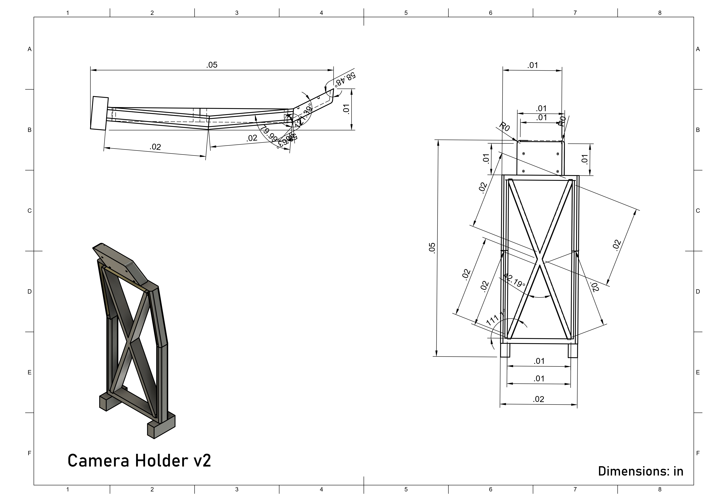

## Content

* `t-photos` contains 2 photos of the team (an official one and one funny photo with all team members)
* `v-photos` contains 6 photos of the vehicle (from every side, from top and bottom)
* `video` contains the video.md file with the link to a video where driving demonstration exists
* `schemes` contains one or several schematic diagrams in form of JPEG, PNG or PDF of the electromechanical components illustrating all the elements (electronic components and motors) used in the vehicle and how they connect to each other.
* `src` contains code of control software for all components which were programmed to participate in the competition
* `models` is for the files for models used by 3D printers, laser cutting machines and CNC machines to produce the vehicle elements. If there is nothing to add to this location, the directory can be removed.
* `other` is for other files which can be used to understand how to prepare the vehicle for the competition. It may include documentation how to connect to a SBC/SBM and upload files there, datasets, hardware specifications, communication protocols descriptions etc. If there is nothing to add to this location, the directory can be removed.

# JAT | WRO \- Documentation |

## Task

The WRO 2025 Future Engineers Self-Driving Cars Challenge tasks teams with designing an autonomous vehicle to complete dynamic racetrack laps and perform parallel parking, adapting to randomized layouts and traffic signs. Teams must also document their engineering process in a public GitHub repository, showcasing innovation, adaptability, and technical problem-solving.

### Challenge Descriptions:

#### 1\. [Open Challenge](OpenChallenge)

Objective: The vehicle must autonomously complete three laps on a racetrack that varies in layout for each round.

**Key Elements:**

The track includes randomized corridor widths (narrow or wide sections) and changes in starting positions.

Adaptability is critical, as the track configuration (e.g., wall placements, starting zones) is determined by a randomization process (e.g., coin tosses, dice rolls) before each round.

#### 2\. [Obstacle Challenge]()

Objective: The vehicle must complete three laps on a track with randomly placed traffic signs and then perform a parallel parking maneuver in a designated area.

**Key Elements:**

Traffic Signs: Red and green pillars indicate required driving lanes (red \= keep right, green \= keep left). The vehicle must obey these rules without displacing the signs.

Parking Task: After completing laps, the vehicle must park within a narrow, variable-sized parking space. Starting inside the parking lot and achieving parallel alignment earns bonus points.

Randomization affects traffic sign positions, parking lot placement, and driving direction (clockwise/counterclockwise).

# 

Table of Contents
=====
- [Introduction](#introduction)
- [Engineering Materials](#engineering-materials)
  - [1. Raspberry Pi 5](#1-raspberry-pi-5)
  - [2. Raspberry Pi 5 Expansion Board](#2-raspberry-pi-5-expansion-board)
  - [3. Micro Servo 99 SG90](#3-micro-servo-99-sg90)
  - [4. K989 1/28 WL Toys Chassis](#4-k989-128-wl-toys-chassis)
  - [5. Furitek Micro Komodo Motor](#5-furitek-micro-komodo-motor)
  - [Cost Report](https://github.com/Jayden-boop/WRO-2025/blob/main/README.md#cost-report)
- [Assembly](#assembly)
- [Conclusion](#conclusion)

Engineering materials
=====

This repository contains engineering materials of a self-driven vehicle's model participating in the WRO Future Engineers competition in the season 2025.

# Introduction

## Engineering Materials

### 1\. Raspberry Pi 5

Why:  
The Raspberry Pi 5 serves as the vehicle’s "brain," providing the computational power required for autonomous navigation and real-time decision-making. Its quad-core CPU and GPIO capabilities support complex tasks like sensor fusion (e.g., camera data, ultrasonic sensors) and path-planning algorithms.

### 2\. Raspberry Pi 5 Expansion Board

Why:  
The expansion board simplifies wiring, ensuring stable power distribution and modular sensor/motor integration. This reduces electrical noise and debugging time during high-pressure rounds.

### 3\.3. HS-5055MG Servo
Why:

The HS-5055MG servo was chosen for its efficient performance in our robotics project. The expansion board simplifies wiring, ensuring stable power distribution and modular integration of sensors and motors. This design reduces electrical noise and minimizes debugging time during high-pressure rounds, enhancing overall reliability
The HS-5055MG is a lightweight, precise servo for steering control. Its 180° range and torque (1.8 kg/cm) allow accurate turns while adhering to the vehicle’s size/weight limits (Rule 11.1: ≤300x200mm, ≤1.5kg).

<table>
  <tr>
    <td width="50%" style="text-align: left;">
     
    </td>
    <td width="50%" style="text-align: left; vertical-align: top;">
      <h3>Specifications:</h3>
      <ul>
        <li>KV: 3450 RPM/Volt</li>
        <li>No-load current @ 10V: 0.7A</li>
        <li>Power: 120W</li>
        <li>Battery: 2–3S LiPo</li>
        <li>Resistance: 0.16 Ω</li>
        <li>Max Current: 10A</li>
        <li>Motor Size: 15.5 × 20.6 mm</li>
        <li>Shaft Size: 1.5 × 6 mm</li>
        <li>Weight: 17.5 g</li>
      </ul>
    </td>
  </tr>
</table>

### 4\. K989 1/28 WL Toys Chassis

Why:  
This modular RC chassis provides a pre-built 4-wheeled platform with a differential drive system. While Rule 11.3 prohibits differential wheeled robots, the chassis can be modified to use a single steering actuator (SG90) and compliant drive system (Furitek motor \+ gearbox).

### 5\. Furitek Micro Komodo Motor

Why:  
This brushless motor delivers high torque and smooth speed control in a compact package. It powers the drive axle via a gear system, ensuring efficient navigation of variable track widths (600–1000mm) and slopes.

<table>
  <tr>
    <td width="60%" style="text-align: left;">
     
    </td>
    <td width="40%" style="text-align: left; vertical-align: top;">
      <h3>Specifications:</h3>
      <ul>
        <li>KV: 3450 RPM/Volt</li>
        <li>No-load current @ 10V: 0.7A</li>
        <li>Power: 120W</li>
        <li>Battery: 2–3S LiPo</li>
        <li>Resistance: 0.16 Ω</li>
        <li>Max Current: 10A</li>
        <li>Motor Size: 15.5 × 20.6 mm</li>
        <li>Shaft Size: 1.5 × 6 mm</li>
        <li>Weight: 17.5 g</li>
      </ul>
    </td>
  </tr>
</table>

## Cost Report

| Component                                              | Quantity | Unit Price (CAD) | Total Cost (CAD) |
|--------------------------------------------------------|----------|------------------|------------------|
| Raspberry Pi 5 (8GB)                                   | 1        | $139.99          | $139.99          |
| Pi 5 Expansion Board                                   | 1        | $55.87           | $55.87           |
| HS-5055MG Servo                                        | 1        | $34.91           | $34.91           |
| K989 1/28 WL Toys Chassis                              | 1        | $105.68          | $105.68          |
| Furitek Micro Komodo Motor                             | 1        | $48.88           | $48.88           |
| LDRobot D500 LiDAR Kit                                 | 1        | $99.60           | $99.60           |
| Texas Instruments TPS22918DBVR Power Switch ICs        | 1        | $0.64            | $0.64            |
| Battery Pack (2S LiPo 7.4V ~2000mAh)                    | 2        | $80.35           | $160.70          |
| Diyeeni Zero Module Camera (5MB, 1080p HD)             | 1        | $46.85           | $46.85           |

## Assembly

*To prepare the vehicle for the WRO Future Engineers challenge, begin by modifying the K989 1/28 RC chassis to comply with the standards of the competition. The original steering system and internal electronics were removed to make space for components with precise control.*

Printing Parts
3D printable parts can be found in GitHub's 3d-models folder. The parts were printed using — with the following guidelines.
Material: PLA
Layer Height: ------------
Infill: 20%
Infill Pattern: Cubic
Supports: Yes

Steering system
Disassemble the stock steering motor from the K989 chassis. Replace with a Micro Servo 99 SG90 mounted to the front of the chassis, taped and screwed into the mount.

A 2mm metal rod was used to connect the steering axle to the servo
The servo mount was attached to the chassis using screws, securing the servo firmly in place.

3: Assemble powertrain
- Mount the Furitek micro Komodo to the 3D-printed motor mount. 
- Secure the mount with double-sided tape or small screws.
- Align the pinion gear with the drivetrain gear to ensure a smooth rotation.

4: Attaching Electronics
- A Raspberry Pi expansion board(PCB?) was mounted to the 3d printed
- The Battery Pack was placed in front of the 
- The camera module was mounted at an angle over the top of the car to increase visibility.

 

## Conclusion

